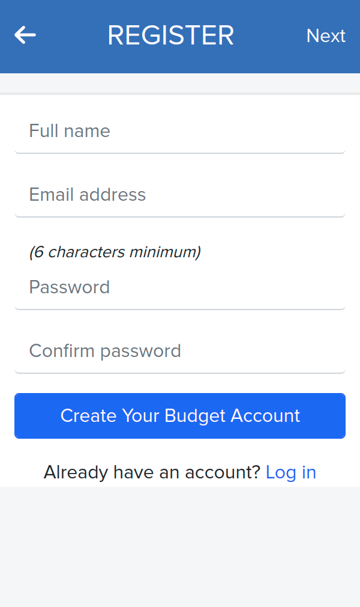

# Budget App

This app is a simple budget app in which a user can add as many items to their list budget, including things to buy and the amount they cost, and it tracks the items that are yet purchased.

## Web presentation

| HOME   | LOGIN   | SIGN UP   | FORGET PASSWORD                                                     |
| --------- | --------- | --------- | --------- |
|           |                     |                             |       |

| CATEGORY   | NEW CATEGORY   | TRANSACTION   | NEW TRANSACTION                                                     |
| --------- | --------- | --------- | --------- |
|           |                     |                             |       |

## Built With

- Ruby
- Ruby on Rails
- Bootstrap

## Getting Started

To get a local copy up and running follow these simple example steps.

### Prerequisites

##### Step 0: Prerequisites
- A text editor [Vscode](https://code.visualstudio.com/download)

##### Step 1: Downloading and Installing `ruby` and `ruby on rails`

[MacOs, windows and Linux](https://www.ruby-lang.org/en/downloads/) # download ruby

[install ruby on rails](https://guides.rubyonrails.org/getting_started.html#creating-a-new-rails-project-installing-rails)

<b>Clone the repository</b>

- Clone this repository or download the Zip folder:

~~~ bash
https://github.com/zieeco/budget-app.git

~~~

1. Navigate to the location of the folder in your machine:

~~~

you@your-Pc-name:~$ cd <folder>
~~~

<b>Usage</b>

**Get the Gem files and node_modules**

~~~ bash
bundle install
npm install
~~~

<b>Start</b>

**Start the app**

~~~ bash
rails s
~~~
- [visit page in the browser](http://127.0.0.1:3000)

<b>Run test</b>

**Run all test**

~~~ bash
rspec # run all test
rspec spec/ # run all tests also
rspec spec/models/ # test the models
~~~

## Author

👤 **zieeco**

- GitHub: [@zieeco](https://github.com/zieeco)
- Twitter [@zieecodes](https://twitter.com/zieecodes)
- LinkedIn: [Isaac Imaobong Samuel](https://www.linkedin.com/in/isaac-imaobong-samuel)

## 🤝 Contributing

Contributions, issues, and feature requests are welcome!

Feel free to check the [issues page](https://github.com/zieeco/budget-app.git/issues).

## Show your support

Give a ⭐️ if you like this project!

## Acknowledgments

- Hat tip to [Microverse](https://bit.ly/MicroverseTN) for providing the project requirements and for the distribution of tasks.

- Original design idea by [Gregoire Vella on Behance](https://www.behance.net/gregoirevella) in accordance to the with the [Creative Commons license of the design](https://creativecommons.org/licenses/by-nc/4.0/).

## 📝 License

This project is [MIT](./MIT.md) licensed.
